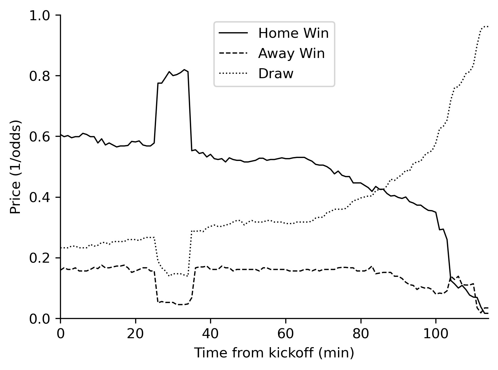
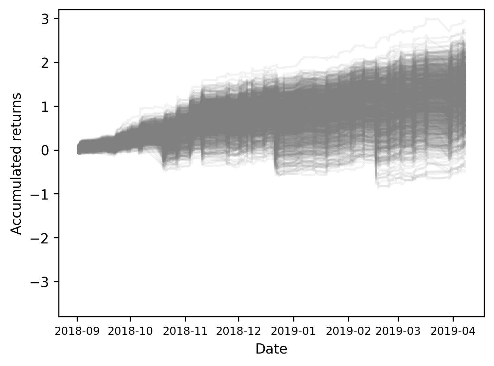

# TL;DR

This is an economics research 📚 and data science 📊 project to test behavioral aspects of traders' actions by assessing a prediction market's semi-strong form efficiency using machine learning.  

# Overview
We study the pricing behavior in the in-play betting market 💰 on the outcomes of soccer matches. ⚽  
A bet price can be understood as the price of a binary option that is worth $1 if team A wins and $0 otherwise.
In a betting exchange, anonymous traders bet on a team to win the match, and other traders bet on the same team to **not** win the match, so it is a zero-sum game (ignoring commissions).  
The market is live during the game and reacts to news. If a team scores a goal, the probability of that team winning the match increases, so the bet price changes.  
The figure below displays prices for the match Sevilla vs.Espanyol, LaLiga(Spain), August19, 2017. Sevilla&mdash;the home team and pre-match favorite&mdash;scored a goal at minute 26 and conceded at minute 35. Note the corresponding jumps in prices.   

If the market is semi-strong form efficient, the price of the bet on a team winning should always reflect the probability of that team winning, including after major news such as goals, and one should not be able to profit by exploring biases in the prices. So, for instance, bets traded at $0.50 should correspond to the team winning 50% of the time.  
We check this by devising a prediction model and simulating an investment strategy based on the model's predictions.

# Data
We gather minute-by-minute traded prices for approximately 30 thousand matches from [Betfair](https://www.betfair.com), and game data (such as the timing of goals) from [Footystats](https://footystats.org/).

# Hypotheses
We test whether the market reaction to goals is occasionally conservative, thus the price update is somewhat slow.  
The null hypothesis is semi-strong form market efficiency:  
- **H0**: market participants precisely react to goals and price updates are full immediately after the goal.  

The alternative hypotheses are:  
- **H1**: market participants underreact to goals and price updates are not full in a time window after the goal. The consequence is that prices are inefficient in this time window.  
- **H2**: the market corrects the prices and in the subsequent time window prices are efficient. 

# Method
The method is a prediction test with public information.  
We gather historical data on prediction markets of soccer match results from [Betfair](https://www.betfair.com) and train a machine learning prediction model for the dynamics of prices of bets associated with the team that scores a goal.  
We then devise an investment strategy based on the model’s predictions and perform a Monte Carlo simulation to compare the returns of a naïve portfolio based on all goals (the benchmark), with the returns of a portfolio based on the investment strategy.  
The generation of excess returns would indicate semi-strong form market inefficiency. 
# Results
Our model’s results suggest that bettors tend to react conservatively to the goals, and ignite thereby a somewhat slow subsequent market-price update.  
The portfolios based on the predictions of our machine-learning model generate excessive returns 💰 without being riskier than the benchmark, suggesting semi-strong inefficiency in the time window from the moment that the goal was identified in the data, to the next
minute.  
The image below displays the results of a Monte Carlo simulation where we buy a bet on the team that scored a goal ⚽, at the minute when the goal is identified, if the model predicts that the price will go up 📈 above a certain threshold at the next minute. We then sell the bet at the next minute.  Note the positive general trend, indicating excessive returns.  

Further, portfolios based on our model’s predictions do not generate excessive
returns if the same strategy is applied to the minute subsequent to the goal, suggesting that the inefficiency window lasts
for about one minute. ⏱

# Repo structure

